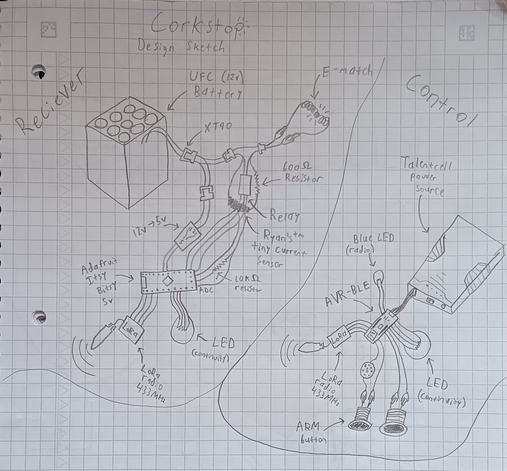
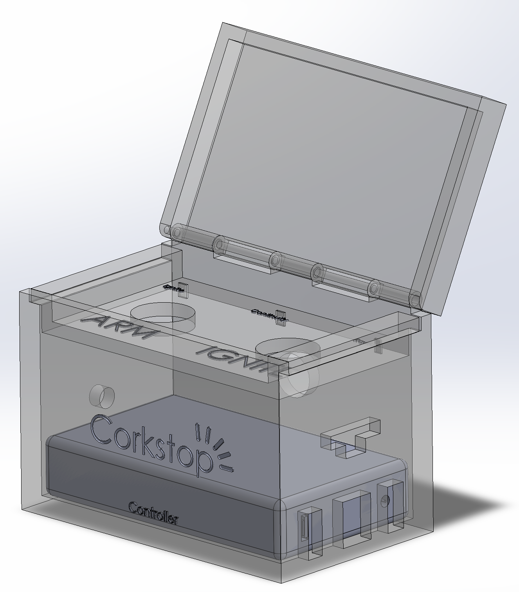

### Remote Ignition System
Corkstop is a single channel ignition system that operates alongside an e-match or igniter to remotely launch a rocket or activate a stationary rocket motor.

## Power:
Corkstop uses a 14v, 24A custom battery to ignite e-matches and igniters.
## Range:
Corkstop uses a 433MHz LoRa radio, meaning it should support ranges up to half a mile or more in optimal conditions.
## How to use:
Connect the battery to the XT60 plug on the receiver box, use the alligator clips from the receiver box to connect an e-match or igniter. The continuity LED on the receiver will indicate whether the match is properly connected. GREEN indicates continuity, while RED indicates that the circuit is broken. There is no power switch on the receiver, it is active at all times if the battery is plugged in.

Continuity information is also available through the continuity LED on the controller. The controller has a power switch. The blue RF light will pulse on and off once a second, if the blue RF light is not pulsing then it means the controller could not connect to the receiver. Verify both RF connectivity and circuit continuity before attempting to ignite.

To ignite the charge, hold down the blue ARM button and verify that the control box is emitting an audible tone. Then, with the ARM button held down, press the red IGNITE button. This will light the e-match or igniter on the receiver side.

## Design Sketch:

*note that the battery is actually 14v, not 12v. And the resistor value has been updated to 700Ω
*note that the XT60 connector is used, not the XT90

